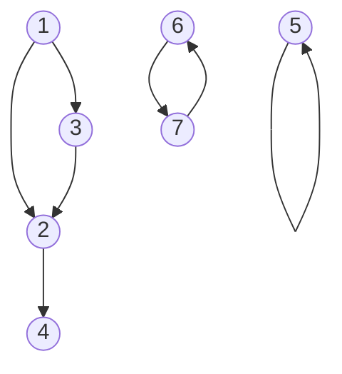
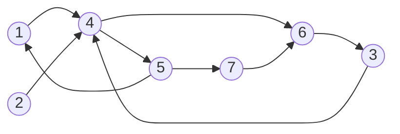

## Отчёт по лабораторной работе № 3

#### № группы: ПМ-2501

#### Выполнил: Роднов Леонид Михайлович

#### Вариант: 20

---
### Содержание

- [1. Постановка задачи](#1-постановка-задачи)
- [2. Математическая модель](#2-математическая-модель)
- [3. Выбор структуры данных](#3-выбор-структуры-данных)
- [4. Программа](#4-программа)
- [5. Анализ правильности решения](#5-анализ-правильности-решения)

---
## Направленный граф

### 1. Постановка задачи

**Условие**
> Разработать программу для работы с направленным графом,
> представленным в виде набора рёбер. Реализовать функции
> добавления и удаления рёбер и вершин, анализа структуры
> графа и выполнения операций над графами.

**Описание функционала**

>1. Вывод графа  
>
>Отображает все рёбра графа в порядке их добавления. Каждое
>ребро представлено парой чисел: «ID откуда» и «ID куда».
> 
>2. Добавление ребра  
>
>Добавляет ребро в граф по двум ID вершин: начальной и
>конечной. Рёбра должны быть уникальны. Рёбра, соединяющие
>вершину саму с собой, не добавляются.
> 
>3. Вывод ID всех вершин  
>
>Отображает список всех вершин в графе. Допускается вывод
>без определённого порядка, но предпочтительно по возрастанию.
> 
>4. Вершины с минимальным числом рёбер  
>
>Возвращает номера вершин, в которых соединяется не менее
>указанного количества рёбер.
> 
>5. Вершины с преобладанием входящих рёбер  
>
>Отображает номера вершин, в которые входит больше рёбер, чем выходит.
> 
>6. Перенаправление ребра  
>
>Изменяет текущее направление ребра. Передаются ID начальной
>и конечной вершин. После перенаправления начальная и
>конечная вершины меняются местами.
> 
>7. Удаление ребра  
>
>Удаляет ребро из графа по двум числам: ID начальной и
>конечной вершин.
>
>8. Удаление вершины  
>
>Удаляет указанную вершину из графа. Все рёбра, входящие в
>неё и выходящие из неё, также удаляются.
> 
>9. Удаление вершин с минимальной разницей рёбер  
>
>Удаляет вершины, у которых разница между количеством
>входящих и исходящих рёбер (по модулю) минимальна среди
>всех вершин.
> 
>10. Вершины достижимые за 2 хода
>
>Выводит список вершин, в которые можно попасть из указанной
>вершины за не более чем 2 хода.
> 
>11. Вершины достижимые за n ходов  
>
>Выводит список вершин, в которые можно попасть из указанной
>вершины за не более чем переданное количество ходов (n).
>Решение может быть реализовано рекурсивно или с использованием циклов.
>
>12. Сложение двух графов  
>
>Объединяет два графа. Результирующий граф содержит все
>вершины и рёбра из обоих графов, без повторений.
> 
>13. Удаление повторений из массива  
>
>Предоставляет вспомогательную функцию для создания массива
>без повторений из массива с дублирующими элементами. Может
>быть использована в задачах для возврата уникальных значений.

### 2. Математическая модель

Любой граф - совокупность двух множеств: множества вершин $V$
(vertices) и множества их пар - рёбер $E$ (edges). Так как граф
ориентированный, то множество пар упорядоченно.

Таким, образом, $G(V,E)$ - граф, где $E$ - упорядоченное
множество пар.

Важно, что, $\forall e \in E:e=\{v_1,v_2\}, v_1,v_2 \in V$, при
этом необязательно, что $\forall v \in V$ $v \in e$. То есть,
в графе могут быть висячие вершины, не связанные рёбрами.

Также, если $e \in E: e= \{v, v\}, v \in V$, то $e$ - петля,
то есть, ребро соединяет вершину с самим собой.

Например, граф можно представить так


### 3. Выбор структуры данных

Согласно математической модели, граф - совокупность множества
вершин $V$ и множества пар вершин - рёбер $E$. Тогда имело бы
место обозначить объекты "вершина" и "ребро".

Класс (объект) вершина (Vertex) хранил бы значение ID вершины.

Класс (объект) ребро (Edge) хранил бы два объекта Vertex, что
соответствовало бы направлению ребра.

Эти классы было бы логично реализовать внутри одного единого
класса "ориентированный граф" (DirectedGraph), так как объекты
"вершина" и "ребро" обычно не рассматриваются отдельно от графа.
Однако, можно оставить возможность обращаться к ним, сделав
классы статичными, т.е. не обязательно создавать экземпляр (объект)
класса DirectedGraph, чтобы создавать вершины и рёбра.

Класс DirectedGraph будет хранить совокупности вершин и рёбер.
Следовательно, одними из полей класса будут массивы типов 
Vertex и Edge.

Так как программа предполагает добавления новых рёбер, а,
соответственно, и вершин, то длина массивов непостоянна. Тогда,
когда, длина массива станет предельной, нужно будет создавать
новые массивы большей длины и копировать туда в них предыдущую информацию.
Чтобы избежать частого копирования, введём новую переменную "maxEdges",
и будем увеличивать её на 20.

В соответствии с прошлым рассуждением, длина массива не будет 
означать количество рёбер/вершин в массиве, тогда нужно будет
хранить значения количеств рёбер/вершин

#### Поля

**class Vertex**

| Название переменной | Тип переменной | Нижняя граница | Верхняя граница |
|---------------------|----------------|----------------|----------------|
| vertexId            | int            | $-2^{31}$      |$2^{31}-1$      |

**class Edge**

| Название переменной | Тип переменной | Нижняя граница | Верхняя граница |
|---------------------|----------------|----------------|----------------|
| vertexFrom          | Vertex         | $-2^{31}$      |$2^{31}-1$      |
| vertexTo            | Vertex         | $-2^{31}$      |$2^{31}-1$      |

**class DirectedGraph**

| Название переменной | Тип переменной | Нижняя граница | Верхняя граница |
|---------------------|----------------|----------------|----------------|
| vertices            | Vertex[]       | -              | -              |
| currentVertices     | int            | 0              | $2^{31}-1$     |
| edges               | Edge[]         | -              | -              |
| currentEdges        | int            | 0              | $2^{31}-1$     |
| maxEdges            | int            | 0              | $2^{31}-1$     |

### 4. Программа

```java
public class DirectedGraph {

    // Класс вершина (содержит ID вершины)
    static class Vertex {
        int vertexId;

        public Vertex(int vertexId) {
            this.vertexId = vertexId;
        }

        public boolean equals(Vertex vertex) {
            return this.vertexId == vertex.vertexId;
        }

        @Override
        public String toString() {
            return String.format("%d", vertexId);
        }
    }

    // Класс Ребро (содержит 2 вершины, которые оно соединяет)
    static class Edge {
        Vertex vertexFrom;
        Vertex vertexTo;

        public Edge(int vertexFrom, int vertexTo) {
            this.vertexFrom = new Vertex(vertexFrom);
            this.vertexTo = new Vertex(vertexTo);
        }

        public Edge(Vertex vertexFrom, Vertex vertexTo) {
            this.vertexFrom = vertexFrom;
            this.vertexTo = vertexTo;
        }

        public Vertex[] listed() {
            return new Vertex[]{vertexFrom, vertexTo};
        }

        public boolean equals(Edge edge) {
            return this.vertexFrom.equals(edge.vertexFrom) && this.vertexTo.equals(edge.vertexTo);
        }

        @Override
        public String toString() {
            return String.format("From %s -> To %s\n", vertexFrom, vertexTo);
        }
    }

    // Граф состоит из множества вершин
    private Vertex[] vertices;
    private int currentVertices = 0;
    // -/- а также состоит из множества пар вершин - рёбер
    private Edge[] edges;
    private int currentEdges = 0;
    // maxEdges - условное значение для максимальной вместимости рёбер
    // Заметим, что максимальная вместимость вершин в 2 раза больше, чем рёбер
    private int maxEdges;

    // если maxEdges на задано, то по умолчанию равно 20
    public DirectedGraph() {
        maxEdges = 20;
        edges = new Edge[maxEdges];
        vertices = new Vertex[maxEdges * 2];
    }

    public DirectedGraph(int maxEdges) {
        this.maxEdges = maxEdges;
        this.edges = new Edge[maxEdges];
        this.vertices = new Vertex[maxEdges * 2];
    }

    // Вершины добавляются после добавления ребра
    private void addVertices(Edge edge) {
        for (Vertex vertex : edge.listed()) {
            // Проверяем, что вершина ещё не добавлена
            boolean alreadyExists = false;
            for (int i = 0; i < currentVertices; ++i)
                if (vertex.equals(vertices[i]))
                    alreadyExists = true;

            if (!alreadyExists) {
                vertices[currentVertices] = vertex;
                ++currentVertices;
            }
        }
    }

    public boolean addEdge(int vertexFrom, int vertexTo) {
        boolean added = false;

        Vertex newVertexFrom = new Vertex(vertexFrom);
        Vertex newVertexTo = new Vertex(vertexTo);
        Edge newEdge = new Edge(newVertexFrom, newVertexTo);

        // Проверяем, не добавлено ли ещё ребро
        boolean alreadyExists = false;
        for (int i = 0; i < currentEdges && !alreadyExists; i++)
            if (newEdge.equals(edges[i]))
                alreadyExists = true;

        if (!alreadyExists) {
            // Если вместимость предельна (равна maxEdges), нужно
            // искусственно увеличить вместимость на 20, чтобы
            // избежать многочисленного копирования при увеличении всего на 1
            if (currentEdges == maxEdges) {
                maxEdges += 20;
                // Копируем значения в новый список
                Edge[] newEdges = new Edge[maxEdges];
                for (int i = 0; i < currentEdges; i++)
                    newEdges[i] = edges[i];

                edges = newEdges;

                // Копируем значения в новый список
                Vertex[] newVertices = new Vertex[maxEdges * 2];
                for (int i = 0; i < currentVertices; i++)
                    newVertices[i] = vertices[i];

                vertices = newVertices;
            }

            edges[currentEdges] = newEdge;
            ++currentEdges;

            // После добавления ребра добавляем вершины, если их
            // ещё нет
            this.addVertices(newEdge);

            added = true;
        }

        return added;
    }

    // Метод был добавлен, чтобы внутри класса можно было
    // сразу добавить ребро, а не по ID вершинам
    private boolean addEdge(Edge edge) {
        return addEdge(edge.vertexFrom.vertexId, edge.vertexTo.vertexId);
    }

    // Вспомогательный метод для сортировки вершин по возрастанию ID
    private void sortVertices(Vertex[] vertices) {
        for (int i = 0; i < currentVertices - 1; ++i) {
            int minIndex = i;
            for (int j = i + 1; j < currentVertices; ++j)
                if (vertices[j].vertexId < vertices[minIndex].vertexId)
                    minIndex = j;

            if (minIndex != i) {
                Vertex buff = vertices[i];
                vertices[i] = vertices[minIndex];
                vertices[minIndex] = buff;
            }
        }
    }

    // Метод вывода на экран всех ID вершин
    public void printVertices() {
        this.sortVertices(vertices);
        for (int i = 0; i < currentVertices; ++i)
            System.out.println((i+1) + ". " + vertices[i]);
    }

    // Метод, возвращающий список вершин с указанным числом рёбер и более
    public int[] verticesWithMinDegree(int vertexDegree) {
        // Не зная конкретное число, создадим массив максимально возможной длины
        int[] verticesWithMinDegree = new int[currentVertices];
        int verticesWithMinDegreeCount = 0;

        // Подсчёт вхождения вершины в рёбра
        for (int i = 0; i < currentVertices; ++i) {
            int count = 0;
            for (int j = 0; j < currentEdges; ++j)
                // Вершина входит в ребро если равна хотя бы одной вершине,
                // содержащейся в ребре
                if (vertices[i].equals(edges[j].vertexFrom) || vertices[i].equals(edges[j].vertexTo))
                    ++count;

            // Добавляем в созданный ранее массив, если количество вхождений
            // вершины в рёбра (число рёбер, соединяющихся в вершине) больше
            // или равно указанного значения
            if (count >= vertexDegree) {
                verticesWithMinDegree[verticesWithMinDegreeCount] = vertices[i].vertexId;
                ++verticesWithMinDegreeCount;
            }
        }

        // Узнав, сколько таких вершин есть, создаём новый массив нужной длины
        // и копируем полученные значения в него
        int[] resizedVerticesWithMinDegree = new int[verticesWithMinDegreeCount];
        for (int i = 0; i < verticesWithMinDegreeCount; ++i)
            resizedVerticesWithMinDegree[i] = verticesWithMinDegree[i];

        return resizedVerticesWithMinDegree;
    }

    // Метод, возвращающий список вершин таких, что число рёбер входящих
    // в вершину больше числа рёбер выходящих из вершины
    public int[] verticesWithInDominantDegree() {
        // Аналогичное рассуждение
        int[] verticesWithInDominantDegree = new int[currentVertices];
        int verticesWithInDominantDegreeCount = 0;

        for (int i = 0; i < currentVertices; ++i) {
            // countIn - число рёбер входящих
            int countIn = 0;
            // countOut - число рёбер выходящих
            int countOut = 0;
            for (int j = 0; j < currentEdges; ++j) {
                if (vertices[i].equals(edges[j].vertexFrom))
                    ++countOut;
                else if (vertices[i].equals(edges[j].vertexTo))
                    ++countIn;
            }

            if (countIn > countOut) {
                verticesWithInDominantDegree[verticesWithInDominantDegreeCount] = vertices[i].vertexId;
                ++verticesWithInDominantDegreeCount;
            }
        }

        // Меняем длину массива, копируя в новый
        int[] resizedVerticesWithInDominant = new int[verticesWithInDominantDegreeCount];
        for (int i = 0; i < verticesWithInDominantDegreeCount; ++i)
            resizedVerticesWithInDominant[i] = verticesWithInDominantDegree[i];

        return resizedVerticesWithInDominant;
    }

    // Метод, меняющий направление ребра
    public boolean edgeRedirect(int vertexFrom, int vertexTo) {
        boolean edgeRedirected = false;

        // Если ребро соединяет одну и ту же вершину (петля), то поменять
        // направление ребра нельзя
        if (vertexFrom == vertexTo)
            return edgeRedirected;

        // Для удобства сравнения рёбер создаём новое ребро
        Edge edgeToRedirect = new Edge(vertexFrom, vertexTo);
        // Проверяем, входит ли оно в множество рёбер графа
        int edgeToRedirectIndex = -1;
        for (int i = 0; i < currentEdges && edgeToRedirectIndex == -1; ++i)
            if (edges[i].equals(edgeToRedirect))
                edgeToRedirectIndex = i;

        // Если индекс нашёлся (не равен -1), то такое ребро есть.
        // Меняем его направление
        if (edgeToRedirectIndex != -1) {
            edges[edgeToRedirectIndex].vertexFrom.vertexId = vertexTo;
            edges[edgeToRedirectIndex].vertexTo.vertexId = vertexFrom;

            edgeRedirected = true;
        }

        return edgeRedirected;
    }

    // Вспомогательный метод, удаляющий ребро с конкретным номером
    private void deleteIndexedEdge(int indexToDelete) {
        // Так как рёбра хранятся в массиве по порядку добавления, то
        // начиная с какого-то индекса все рёбра сдвигаются налево
        for (int i = indexToDelete; i < currentEdges - 1; ++i)
            edges[i] = edges[i + 1];

        --currentEdges;
    }

    // Метод, удаляющий ребро по его ID вершин
    public boolean deleteEdge(int vertexFrom, int vertexTo) {
        // Аналогичное рассуждение
        boolean deleted = false;

        Edge edgeToDelete = new Edge(vertexFrom, vertexTo);
        int indexToDelete = -1;
        for (int i = 0; i < currentEdges && indexToDelete == -1; ++i)
            if (edges[i].equals(edgeToDelete))
                indexToDelete = i;

        // Если ребро нашлось, то удаляем ребро с конкретным номером
        if (indexToDelete != -1) {
            this.deleteIndexedEdge(indexToDelete);
            deleted = true;
        }

        return deleted;
    }

    // Метод, удаляющий вершину конкретного ID
    public boolean deleteVertex(int vertexId) {
        // Аналогичное рассуждение
        boolean deleted = false;

        Vertex vertexToDelete = new Vertex(vertexId);
        int indexToDelete = -1;
        for (int i = 0; i < currentVertices && indexToDelete == -1; ++i)
            if (vertices[i].equals(vertexToDelete))
                indexToDelete = i;

        // Если вершина нашлась, то, т.к. вершины по порядку добавления хранить
        // необязательно, то просто вместо i-й вершины помещаем последнюю
        if (indexToDelete != -1) {
            vertices[indexToDelete] = vertices[currentVertices - 1];
            --currentVertices;

            // Вместе с удалённой вершиной нужно удалить рёбра, связывающие её с
            // другими. Так как при удалении количество рёбер меняется цикл
            // for использовать нельзя
            int i = 0;
            while (i != currentEdges) {
                if (edges[i].vertexFrom.equals(vertexToDelete) || edges[i].vertexTo.equals(vertexToDelete))
                    this.deleteIndexedEdge(i);
                else
                    ++i;
            }

            deleted = true;
        }

        return deleted;
    }

    // Метод, удаляющий вершины, у которых разница (по модулю) между количеством
    // входящих и исходящих рёбер минимальна среди всех вершин
    public boolean deleteVerticesWithMinDegreeDifference() {
        boolean deleted = false;

        if (currentVertices > 0) {
            // Аналогичное рассуждение
            // Создаём массив, который будет соотносить вершину и
            // разность (по модулю) между входящими и исходящими рёбрами
            int[] verticesDegreeDifference = new int[currentVertices];
            // Параллельно с этими значениями, будем вычислять минимальную разность
            int minDifference = -1;
            for (int i = 0; i < currentVertices; ++i) {
                int countIn = 0, countOut = 0;
                for (int j = 0; j < currentEdges; ++j) {
                    if (vertices[i].equals(edges[j].vertexFrom))
                        ++countOut;
                    else if (vertices[i].equals(edges[j].vertexTo))
                        ++countIn;
                }

                verticesDegreeDifference[i] = Math.abs(countIn - countOut);

                if (Math.abs(countIn - countOut) < minDifference || minDifference == -1) {
                    minDifference = Math.abs(countIn - countOut);
                }
            }

            // Удаляем вершины: аналогично, т.к. число вершин меняется, то
            // нельзя использовать цикл for
            int indexToDelete = 0;
            while (indexToDelete != currentVertices) {
                if (verticesDegreeDifference[indexToDelete] == minDifference) {
                    this.deleteVertex(vertices[indexToDelete].vertexId);
                }
                else
                    ++indexToDelete;
            }

            deleted = true;
        }

        return deleted;
    }

    // Вспомогательный метод, возвращающий список с уникальными значениями из указанного
    private int[] uniqueElementsList(int[] array) {
        // Аналогичное рассуждение
        int[] newArray = new int[array.length];
        int count = 0;

        for (int i = 0; i < array.length; ++i) {
            // Проверяем, является ли число уникальным
            boolean isUnique = true;
            for (int j = i - 1; j >= 0 && isUnique; --j)
                if (array[j] == array[i])
                    isUnique = false;

            if (isUnique) {
                newArray[count] = array[i];
                ++count;
            }
        }

        int[] newResizedArray = new int[count];
        for (int i = 0; i < count; ++i)
            newResizedArray[i] = newArray[i];

        return newResizedArray;
    }

    // Вспомогательный метод, проверяющий, является ли элемент уникальным для
    // списка неопределённо длины с фиксированным количеством элементов
    private boolean uniqueElement(int[] array, int count, int element) {
        boolean unique = true;
        for (int i = 0; i < count && unique; ++i)
            if (array[i] == element)
                unique = false;

        return unique;
    }

    // Метод, возвращающий список ID вершин, достижимых за два хода от указанной
    public int[] verticesWithinTwoSteps(int vertexId) {
        // Аналогичное рассуждение
        int[] reachable = new int[currentVertices];
        int count = 0;

        // Проходимся по рёбрам
        for (int i = 0; i < currentEdges; ++i)
            // Если ребро исходит из нужной вершины, оно нам подходит
            if (edges[i].vertexFrom.vertexId == vertexId)
                // Аналогично, проходимся по рёбрам
                for (int j = 0; j < currentEdges; ++j)
                    // Если ребро исходит из вершины, в которую входит прошлое
                    // подходящее ребро, то оно нам подходит
                    if (edges[i].vertexTo.equals(edges[j].vertexFrom))
                        if (uniqueElement(reachable, count, edges[j].vertexTo.vertexId)) {
                            reachable[count] = edges[j].vertexTo.vertexId;
                            ++count;
                        }

        int[] resizedReachable = new int[count];
        for (int i = 0; i < count; ++i)
            resizedReachable[i] = reachable[i];

        return resizedReachable;
    }

    // Метод, возвращающий список вершин, куда ведёт указанная вершина
    private int[] vertexNeighbours(int vertexId) {
        // Аналогичное рассуждение
        int[] neighbours = new int[currentVertices];
        int count = 0;
        // Для удобства сравнение создадим вершину
        Vertex vertexFrom = new Vertex(vertexId);
        for (int i = 0; i < currentEdges; ++i) {
            // Если ребро исходит из указанной вершины, то оно нам подходит
            if (edges[i].vertexFrom.equals(vertexFrom)) {
                neighbours[count] = edges[i].vertexTo.vertexId;
                ++count;
            }
        }

        int[] resizedNeighbours = new int[count];
        for (int i = 0; i < count; ++i)
            resizedNeighbours[i] = neighbours[i];

        return resizedNeighbours;
    }

    // Рекурсивный метод, получающий список из вершин, достижимых за n ходов
    private void getNthNeighbours(int[] neighbours, int[] vertexNeighbours, int n) {
        // Условием остановки - кол-во ходов n = 0
        if (n == 0) {
            // Проходимся по вершинам, куда ведёт прошлая вершина
            for (int i = 0; i < vertexNeighbours.length; ++i) {
                // Чтобы добавить в результирующий список, нужно проверить на уникальность
                boolean unique = true;
                for (int j = 1; j < neighbours[0] + 1 && unique; ++j)
                    if (neighbours[j] == vertexNeighbours[i])
                        unique = false;

                if (unique) {
                    neighbours[neighbours[0] + 1] = vertexNeighbours[i];
                    ++neighbours[0];
                }
            }

        } else
            for (int vertex : vertexNeighbours)
                getNthNeighbours(neighbours, vertexNeighbours(vertex), n - 1);
    }

    // Метод, возвращающий список вершин, достижимых за n ходов из указанной вершины
    public int[] verticesWithinNSteps(int vertexId, int n) {
        // Ограничение на n
        if (n <= 0)
            return new int[0];

        // Первый элемент зарезервируем под количество эл-ов
        int[] neighbours = new int[currentVertices + 1];

        // Запускаем поиск нужных вершин
        getNthNeighbours(neighbours, vertexNeighbours(vertexId), n - 1);

        int[] resizedNeighbours = new int[neighbours[0]];
        for (int i = 0; i < neighbours[0]; ++i)
            resizedNeighbours[i] = neighbours[i + 1];

        return resizedNeighbours;
    }

    // Метод, складывающий два графа
    public DirectedGraph plus(DirectedGraph graph) {
        // Результирующий граф содержит рёбра обоих графов
        DirectedGraph newGraph = new DirectedGraph(currentEdges + graph.currentEdges);

        // Сначала копируем значение этого графа в результирующий
        newGraph.currentEdges = this.currentEdges;
        newGraph.currentVertices = this.currentVertices;
        for (int i = 0; i < this.currentEdges; ++i)
            newGraph.edges[i] = this.edges[i];

        for (int i = 0; i < this.currentVertices; ++i) {
            newGraph.vertices[i] = this.vertices[i];
        }

        // Затем добавляем рёбра второго графа без повторений
        for (int i = 0; i < graph.currentEdges; ++i)
            newGraph.addEdge(graph.edges[i]);

        return newGraph;
    }

    @Override
    public String toString() {
        String res = "";
        for (int i = 0; i < currentEdges; i++)
            res = String.format("%s%d. %s", res, i+1, edges[i]);

        return res;
    }
}
```

### 5. Анализ правильности решения

Проверять правильность решения будем по порядку введения функционала

1. Вывод графа

- Input:
```
DirectedGraph g = new DirectedGraph();
g.addEdge(1,2);
g.addEdge(1,3);
g.addEdge(2,4);
 g.addEdge(3,4);
out.println(g);
```
- Output:
```
1. From 1 -> To 2
2. From 1 -> To 3
3. From 2 -> To 4
4. From 3 -> To 4
```

2. Добавление ребра

- Input:
```
DirectedGraph g = new DirectedGraph();
out.println(g.addEdge(1, 1));
out.println(g.addEdge(1, 3));
out.println(g.addEdge(3, 2));
out.println(g.addEdge(2, 4));
out.println(g.addEdge(2,4));
out.println(g.addEdge(4, 2));
out.println(g);
```
- Output:
```
true
true
true
true
false
true
1. From 1 -> To 1
2. From 1 -> To 3
3. From 3 -> To 2
4. From 2 -> To 4
5. From 4 -> To 2
```

3. Вывод ID всех вершин

- Input:
```
DirectedGraph g = new DirectedGraph();
g.addEdge(1, 1);
g.printVertices();
g.addEdge(1,3);
g.printVertices();
g.addEdge(2,4);
g.printVertices();
```
- Output:
```
1. 1
1. 1
2. 3
1. 1
2. 2
3. 3
4. 4
```

4. Вершины с минимальным числом рёбер

С этого моменты будем рассматривать такой граф:


- Input:
```
DirectedGraph g = new DirectedGraph();
g.addEdge(1, 4);
g.addEdge(2, 4);
g.addEdge(3, 4);
g.addEdge(4, 5);
g.addEdge(4, 6);
g.addEdge(5, 7);
g.addEdge(5, 1);
g.addEdge(7, 6);
g.addEdge(6, 3);
int[] n = g.verticesWithMinDegree(3);
for (int x : n)
    out.print(x + " ");
```
- Output:
```
4 5 6
```

5. Вершины с преобладанием входящих рёбер

- Input:
```
DirectedGraph g = new DirectedGraph();
g.addEdge(1, 4);
g.addEdge(2, 4);
g.addEdge(3, 4);
g.addEdge(4, 5);
g.addEdge(4, 6);
g.addEdge(5, 7);
g.addEdge(5, 1);
g.addEdge(7, 6);
g.addEdge(6, 3);
int[] n = g.verticesWithInDominantDegree();
for (int x : n)
    out.print(x + " ");
```
- Output:
```
4 6 
```

6. Вывод графа

- Input:
```
DirectedGraph g = new DirectedGraph();
g.addEdge(1, 2);
g.addEdge(1, 3);
g.addEdge(2, 4);
g.addEdge(3, 4);
out.println(g);
out.println();
out.println(g.edgeRedirect(1, 2));
out.println(g.edgeRedirect(1, 4));
out.println(g);
```
- Output:
```
1. From 1 -> To 2
2. From 1 -> To 3
3. From 2 -> To 4
4. From 3 -> To 4

true
false
1. From 2 -> To 1
2. From 1 -> To 3
3. From 2 -> To 4
4. From 3 -> To 4
```

7. Удаление ребра

- Input:
```
DirectedGraph g = new DirectedGraph();
g.addEdge(1, 4);
g.addEdge(2, 4);
g.addEdge(3, 4);
g.addEdge(4, 5);
g.addEdge(4, 6);
g.addEdge(5, 7);
g.addEdge(5, 1);
g.addEdge(7, 6);
g.addEdge(6, 3);
out.println(g);
out.println(g.deleteEdge(1, 4);
out.println(g.deleteEdge(1, 2);
out.println(g);
```
- Output:
```
1. From 1 -> To 4
2. From 2 -> To 4
3. From 3 -> To 4
4. From 4 -> To 5
5. From 4 -> To 6
6. From 5 -> To 7
7. From 5 -> To 1
8. From 7 -> To 6
9. From 6 -> To 3

true
false
1. From 2 -> To 4
2. From 3 -> To 4
3. From 4 -> To 5
4. From 4 -> To 6
5. From 5 -> To 7
6. From 5 -> To 1
7. From 7 -> To 6
8. From 6 -> To 3
```

8. Удаление вершины

- Input:
```
DirectedGraph g = new DirectedGraph();
g.addEdge(1, 4);
g.addEdge(2, 4);
g.addEdge(3, 4);
g.addEdge(4, 5);
g.addEdge(4, 6);
g.addEdge(5, 7);
g.addEdge(5, 1);
g.addEdge(7, 6);
g.addEdge(6, 3);
out.println(g);
out.println(g.deleteVertex(4));
out.println(g.deleteVertex(0));
out.println(g);
```
- Output:
```
1. From 1 -> To 4
2. From 2 -> To 4
3. From 3 -> To 4
4. From 4 -> To 5
5. From 4 -> To 6
6. From 5 -> To 7
7. From 5 -> To 1
8. From 7 -> To 6
9. From 6 -> To 3

true
false
1. From 5 -> To 7
2. From 5 -> To 1
3. From 7 -> To 6
4. From 6 -> To 3
```

9. Удаление вершин с минимальной разницей рёбер

- Input:
```
DirectedGraph g = new DirectedGraph();
g.addEdge(1, 4);
g.addEdge(2, 4);
g.addEdge(3, 4);
g.addEdge(4, 5);
g.addEdge(4, 6);
g.addEdge(5, 7);
g.addEdge(5, 1);
g.addEdge(7, 6);
g.addEdge(6, 3);
```
- Output:
```
1. From 1 -> To 4
2. From 2 -> To 4
3. From 3 -> To 4
4. From 4 -> To 5
5. From 4 -> To 6
6. From 5 -> To 7
7. From 5 -> To 1
8. From 7 -> To 6
9. From 6 -> To 3

1. 1
2. 2
3. 3
4. 4
5. 5
6. 6
7. 7
```

1. Вывод графа

- Input:
```
DirectedGraph g = new DirectedGraph();
g.addEdge(1,2);
g.addEdge(1,3);
g.addEdge(2,4);
 g.addEdge(3,4);
out.println(g);
```
- Output:
```
1. From 1 -> To 2
2. From 1 -> To 3
3. From 2 -> To 4
4. From 3 -> To 4
```

1. Вывод графа

- Input:
```
DirectedGraph g = new DirectedGraph();
g.addEdge(1,2);
g.addEdge(1,3);
g.addEdge(2,4);
 g.addEdge(3,4);
out.println(g);
```
- Output:
```
1. From 1 -> To 2
2. From 1 -> To 3
3. From 2 -> To 4
4. From 3 -> To 4
```

1. Вывод графа

- Input:
```
DirectedGraph g = new DirectedGraph();
g.addEdge(1,2);
g.addEdge(1,3);
g.addEdge(2,4);
 g.addEdge(3,4);
out.println(g);
```
- Output:
```
1. From 1 -> To 2
2. From 1 -> To 3
3. From 2 -> To 4
4. From 3 -> To 4
```

1. Вывод графа

- Input:
```
DirectedGraph g = new DirectedGraph();
g.addEdge(1,2);
g.addEdge(1,3);
g.addEdge(2,4);
 g.addEdge(3,4);
out.println(g);
```
- Output:
```
1. From 1 -> To 2
2. From 1 -> To 3
3. From 2 -> To 4
4. From 3 -> To 4
```
